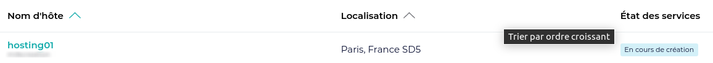
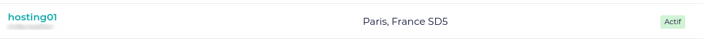

# Création d'un serveur chez Gandi

## Création du serveur

1. Connectez-vous à l'interface d'administration Gandi

[Interface de connection Gandi](https://id.gandi.net)


2. Depuis l'interface d'administration rendez-vous dans l'interface CLOUD et cliquez sur le bouton **Créer un serveur**.


3. Remplissez le formulaire avec les informations suivante :

- Modèle de serveur : ```Small```
- Centre de données : ```FR SD5``` | ```FR SD6```
- Système d'exploitation : ```Debian 10```
- Configuration de serveur :
    - Nom du serveur : ```hostingserver{{ ## }}``` | ```stagingserver{{ ## }}```
    - Nom du super-utilisateur : ```{{ username }}```
    - Mot de passe : ```{{ password }}``` (au moins 12 caractère, au moins 1 maj, au moins 1 caractère spécial)
    - Ajout d'un clé SSH (recommandé) : ```{{ ~/.ssh/id_rsa.pub }}```

Il sera possible d'ajouter une clé SSH à postériori.


4. Le serveur est ```cours de creation```. Patientez jusqu'à ce que le statut passe à ```actif```.





## Configuration du serveur

Depuis la liste des serveurs, cliquez sur le serveur que vous avez créé.


### Coeurs et mémoire

Cliquez sur le lien **modifier** de la section *Coeurs et RAM*.
Adaptez selon le type de serveur et le besoin en ressources. (2x && 2048Mo || 4x && 4096Mo).


Attendez le redémarrage du serveur avant de poursuivre.

### Disques

> **Important** La scalabilité (redimensionnement) des disques chez Gandi, permet, une fois créé d'augmenter sa taille mais pas de la réduire.
>
> Prenez en compte cette contrainte lors de la création des disques de données et de sauvegarde.

Le renommage du disque système nécessite l'arrêt du serveur.


Accèder à l'interface **Gérer les volumes**.


#### Modifiez le nom du disque système

1. Cliquez sur le lien de modification du disque système.


2. Cliquez sur le bouton **Modifier**


3. Adaptez le nom du disque


### Créez le disque de données

1. Cliquez sur la liste **Ajouter** et choisissez l'option *Créer un nouveau volume*.


2. Renseignez les attributs du disque.

Nom: ```{{ (h|r)## }}-datas```
Attacher au serveur: ```{{ (hosting|staging)## }}```
Localisation: FR SD5| FR SD6 (Doit être dans le même centre de données que votre serveur)
Taille: ```{{ [20-50] }}```Go


Patientez jusqu'à la création du disque.


### Créez le disque de sauvegarde

Suivre la même procédure que pour la création du disque de données.


## Configuration des DNS chez Gandi

1. Récupérez l'IPv4 et l'IPv6 du serveur depuis l'interface d'administration du serveur


2. Rendez-vous dans l'interface d'administration des domaines de Gandi

[Liste des domaines Gandi](https://admin.gandi.net/domain/)


3. Sélectionnez le nom de domaine a éditer

Cliquez sur le domaine a éditer et rendez-vous dans l'onglet **Enregistrement DNS**.

4. Configurer ...

@TODO