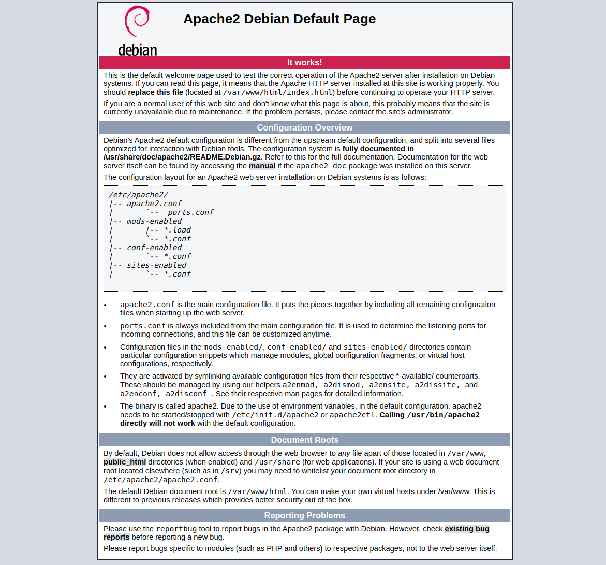

# 06a - Installation d'Apache

```bash
sudo apt install apache2 apache2-utils
```

Récupérer l'IP publique de votre serveur

```bash
sudo ifconfig
```

```bash
eth0: flags=4163<UP,BROADCAST,RUNNING,MULTICAST>  mtu 1500
        inet {{ YOUR_PUBLIC_IP }}  netmask 255.255.252.0  broadcast xxx.xxx.xxx.xxx
        inet6 xxxx::xxxx:xxxx:xxxx:xxxx  prefixlen 64  scopeid 0x20<link>
        inet6 xxxx::xxxx:xxxx:xxxx:xxxx  prefixlen 64  scopeid 0x0<global>
        ether xx:xx:xx:xx:xx:xx  txqueuelen 1000  (Ethernet)
        RX packets 5744175  bytes 434615755 (414.4 MiB)
        RX errors 0  dropped 0  overruns 0  frame 0
        TX packets 9078  bytes 1419534 (1.3 MiB)
        TX errors 0  dropped 0 overruns 0  carrier 0  collisions 0

lo: flags=73<UP,LOOPBACK,RUNNING>  mtu 65536
        inet 127.0.0.1  netmask 255.0.0.0
        inet6 ::1  prefixlen 128  scopeid 0x10<host>
        loop  txqueuelen 1000  (Local Loopback)
        RX packets 8  bytes 400 (400.0 B)
        RX errors 0  dropped 0  overruns 0  frame 0
        TX packets 8  bytes 400 (400.0 B)
        TX errors 0  dropped 0 overruns 0  carrier 0  collisions 0
```

Vérifier l'installation d'Apache en visitant la page ```http://{{ YOUR_PUBLIC_IP }}``` depuis votre navigateur.



## Configuration des variables d'environnement

```bash
sudo vi /etc/apache2/envvars
```

```diff
+export SERVER_DATAS_PATH="/srv/{{ (h|r)## }}-datas"
+export SERVER_BACKUP_PATH="/srv/{{ (h|r)## }}-backup"
+export SERVER_HOSTNAME="{{ DNS_hostname }}"
+export SERVER_ADMIN_EMAIL="{{ admin_email }}"
```

## Création de l'hôte virtuel par défaut

1. Création de l'architecture du répertoire du site par défaut

```bash
sudo mkdir ${SERVER_DATAS_PATH}/var/www/html/000-default && \
cd ${SERVER_DATAS_PATH}/var/www/html/000-default/ && \
sudo mkdir cnf htdocs log tmp
```

2. Créer la page par défaut

```bash
sudo vi htdocs/index.html
```

```html
<!DOCTYPE html>
<html lang="fr-FR">
<head>
    <meta charset="UTF-8" />
    <meta name="viewport" content="width=device-width, initial-scale=1">
    <title>Page par défaut du serveur d'hébergement</title>
    <meta name="robots" content="noindex, nofollow">
</head>
<body>
    <h1>Bonjour,</h1>
    <p>Vous naviguez actuellement sur la page par défaut du serveur d'hébergement.</p>
</body>
</html>
```

3. Copier la déclaration de l'hôte virtuel par défaut

```bash
sudo cp /etc/apache2/sites-available/000-default.conf ${SERVER_DATAS_PATH}/etc/apache2/sites-available/
```

```bash
sudo vi ${SERVER_DATAS_PATH}/etc/apache2/sites-available/000-default.conf
```

4. Éditer la nouvelle déclaration de l'hôte virtuel par défaut

```diff
<VirtualHost *:80>
        # The ServerName directive sets the request scheme, hostname and port that
        # the server uses to identify itself. This is used when creating
        # redirection URLs. In the context of virtual hosts, the ServerName
        # specifies what hostname must appear in the request's Host: header to
        # match this virtual host. For the default virtual host (this file) this
        # value is not decisive as it is used as a last resort host regardless.
        # However, you must set it for any further virtual host explicitly.
        #ServerName www.example.com

        ServerAdmin webmaster@localhost
-        DocumentRoot /var/www/html
+        DocumentRoot ${SERVER_DATAS_PATH}/var/www/html/000-default/htdocs

        # Available loglevels: trace8, ..., trace1, debug, info, notice, warn,
        # error, crit, alert, emerg.
        # It is also possible to configure the loglevel for particular
        # modules, e.g.
        #LogLevel info ssl:warn

        ErrorLog ${APACHE_LOG_DIR}/error.log
        CustomLog ${APACHE_LOG_DIR}/access.log combined

        # For most configuration files from conf-available/, which are
        # enabled or disabled at a global level, it is possible to
        # include a line for only one particular virtual host. For example the
        # following line enables the CGI configuration for this host only
        # after it has been globally disabled with "a2disconf".
        #Include conf-available/serve-cgi-bin.conf

+        <Directory ${SERVER_DATAS_PATH}/var/www/html/000-default/htdocs/>
+            Options -Indexes +FollowSymLinks +MultiViews
+            AllowOverride All
+            Order Allow,Deny
+            Allow from all
+            Require all granted
+        </Directory>
</VirtualHost>
```

5. Modifier la référence active de l'hôte par défaut

```bash
cd /etc/apache2/sites-enabled/ && \
sudo rm 000-default.conf && \
sudo ln -s ${SERVER_DATAS_PATH}/etc/apache2/sites-available/000-default.conf && \
sudo service apache2 restart
```

Vérifier la modification de la page du serveur par défaut en visitant la page ```http://{{ YOUR_PUBLIC_IP }}``` depuis votre navigateur.


## Activation des modules

```bash
sudo a2enmod headers expires rewrite actions macro ssl
```

```bash
sudo systemctl restart apache2
```

## Configuration d'Apache

### Deflate

```bash
sudo vi ${SERVER_DATAS_PATH}/etc/apache2/conf-available/deflate.conf
```

```bash
<IfModule mod_deflate.c>
  SetOutputFilter DEFLATE
  DeflateCompressionLevel 9
</IfModule>

<Location />
  AddOutputFilterByType DEFLATE application/atom_xml
  AddOutputFilterByType DEFLATE application/rss+xml
  AddOutputFilterByType DEFLATE application/vnd.ms-fontobject
  AddOutputFilterByType DEFLATE application/x-font
  AddOutputFilterByType DEFLATE application/x-font-opentype
  AddOutputFilterByType DEFLATE application/x-font-otf
  AddOutputFilterByType DEFLATE application/x-font-truetype
  AddOutputFilterByType DEFLATE application/x-font-ttf
  AddOutputFilterByType DEFLATE application/x-javascript
  AddOutputFilterByType DEFLATE application/xhtml+xml
  AddOutputFilterByType DEFLATE application/xml
  AddOutputFilterByType DEFLATE font/opentype
  AddOutputFilterByType DEFLATE font/otf
  AddOutputFilterByType DEFLATE font/ttf
  AddOutputFilterByType DEFLATE image/svg+xml
  AddOutputFilterByType DEFLATE image/x-icon
  AddOutputFilterByType DEFLATE text/css
  AddOutputFilterByType DEFLATE text/html
  AddOutputFilterByType DEFLATE text/javascript
  AddOutputFilterByType DEFLATE text/plain
  AddOutputFilterByType DEFLATE text/xml

  BrowserMatch ^Mozilla/4 gzip-only-text/html 
  BrowserMatch ^Mozilla/4.0[678] no-gzip 
  BrowserMatch \bMSIE !no-gzip !gzip-only-text/html

  Header append Vary User-Agent env=!dont-vary
</Location>
```

### Etags

```bash
sudo vi ${SERVER_DATAS_PATH}/etc/apache2/conf-available/etags.conf
```

```bash
Header unset ETag
FileETag none
```

### Expires

```bash
sudo vi ${SERVER_DATAS_PATH}/etc/apache2/conf-available/expires.conf
```

```bash
<IfModule mod_expires.c>
 ExpiresActive On
 ExpiresDefault "access plus 7200 seconds"
 ExpiresByType image/jpg "access plus 2592000 seconds"
 ExpiresByType image/jpeg "access plus 2592000 seconds"
 ExpiresByType image/png "access plus 2592000 seconds"
 ExpiresByType image/gif "access plus 2592000 seconds"
 AddType image/x-icon .ico
 ExpiresByType image/ico "access plus 2592000 seconds"
 ExpiresByType image/icon "access plus 2592000 seconds"
 ExpiresByType image/x-icon "access plus 2592000 seconds"
 ExpiresByType text/css "access plus 2592000 seconds"
 ExpiresByType text/javascript "access plus 2592000 seconds"
 ExpiresByType text/html "access plus 7200 seconds"
 ExpiresByType application/xhtml+xml "access plus 7200 seconds"
 ExpiresByType application/javascript A2592000
 ExpiresByType application/x-javascript "access plus 2592000 seconds"
 ExpiresByType application/x-shockwave-flash "access plus 2592000 seconds"

 AddType application/vnd.ms-fontobject .eot
 AddType application/x-font-ttf .ttf
 AddType application/x-font-opentype .otf
 AddType application/x-font-woff .woff
 AddType image/svg+xml .svg
 
 AddOutputFilterByType DEFLATE application/x-font-ttf application/x-font-opentype image/svg+xml

 ExpiresActive on

 ExpiresByType application/vnd.ms-fontobject "access plus 1 year"
 ExpiresByType application/x-font-ttf "access plus 1 year"
 ExpiresByType application/x-font-opentype "access plus 1 year"
 ExpiresByType application/x-font-woff "access plus 1 year"
 ExpiresByType image/svg+xml "access plus 1 year"
</IfModule>
```

### Headers

```bash
sudo vi ${SERVER_DATAS_PATH}/etc/apache2/conf-available/headers.conf
```

```bash
<IfModule mod_headers.c>
  <FilesMatch "\.(ico|jpe?g|png|gif|swf|css|gz)$">
    Header set Cache-Control "max-age=31536000, public"
  </FilesMatch>
  <FilesMatch "\.(js)$">
    Header set Cache-Control "max-age=31536000, private"
  </FilesMatch>
  <FilesMatch "\.(html|htm)$">
    Header set Cache-Control "max-age=7200, public"
  </FilesMatch>
  <FilesMatch "\.(pl|php|cgi|spl|scgi|fcgi)$">
    Header unset Cache-Control
  </FilesMatch>
</IfModule>
```

### ServerName

```bash
sudo vi ${SERVER_DATAS_PATH}/etc/apache2/conf-available/servername.conf
```

```bash
ServerName ${SERVER_HOSTNAME}
```

### SSL

```bash
sudo vi ${SERVER_DATAS_PATH}/etc/apache2/conf-available/ssl.conf
```

```bash
<IfModule mod_ssl.c>
    SSLProtocol all -SSLv3 -TLSv1 -TLSv1.1
    SSLCipherSuite          ECDHE-ECDSA-AES128-GCM-SHA256:ECDHE-RSA-AES128-GCM-SHA256:ECDHE-ECDSA-AES256-GCM-SHA384:ECDHE-RSA-AES256-GCM-SHA384:ECDHE-ECDSA-CHACHA20-POLY1305:ECDHE-RSA-CHACHA20-POLY1305:DHE-RSA-AES128-GCM-SHA256:DHE-RSA-AES256-GCM-SHA384
    SSLHonorCipherOrder     off
    SSLSessionTickets       off

    SSLUseStapling On
    SSLStaplingCache "shmcb:logs/ssl_stapling(32768)"
</IfModule>
```

### Charset

```bash
sudo cp /etc/apache2/conf-available/charset.conf ${SERVER_DATAS_PATH}/etc/apache2/conf-available/ && \
sudo vi ${SERVER_DATAS_PATH}/etc/apache2/conf-available/charset.conf
```

```diff
# Read the documentation before enabling AddDefaultCharset.
# In general, it is only a good idea if you know that all your files
# have this encoding. It will override any encoding given in the files
# in meta http-equiv or xml encoding tags.

-#AddDefaultCharset UTF-8
+AddDefaultCharset UTF-8

# vim: syntax=apache ts=4 sw=4 sts=4 sr noet
```

### Security

```bash
sudo cp /etc/apache2/conf-available/security.conf ${SERVER_DATAS_PATH}/etc/apache2/conf-available/ && \
sudo vi ${SERVER_DATAS_PATH}/etc/apache2/conf-available/security.conf
```

```diff
-ServerTokens OS
+ServerTokens Prod

-ServerSignature On
+ServerSignature Off

-#<DirectoryMatch "/\.svn">
-#   Require all denied
-#</DirectoryMatch>
+<DirectoryMatch "/\.svn">
+   Require all denied
+</DirectoryMatch>

-#Header set X-Content-Type-Options: "nosniff"
+Header set X-Content-Type-Options: "nosniff"

-#Header set X-Frame-Options: "sameorigin"
+Header set X-Frame-Options: "sameorigin"
```

### Macro

```bash
sudo vi ${SERVER_DATAS_PATH}/etc/apache2/conf-available/macro.conf
```

```bash
# Hôte standard
<Macro vhost ${hostname}>
  Use vhost_custom ${hostname} htdocs
</Macro>

# Hôte sous-répertoire public
<Macro vhost_public ${hostname}>
  Use vhost_custom ${hostname} htdocs/public
</Macro>

# Hôte sous-répertoire personnalisé
<Macro vhost_custom ${hostname} ${dir}>
  Use vhost_basedir ${SERVER_DATAS_PATH}/var/www/html ${hostname} ${dir}
</Macro>

# Hôte répertoire racine + sous-repertoire personnalisés
<Macro vhost_basedir ${basedir} ${hostname} ${dir}>
  Use vhost_logdir ${SERVER_DATAS_PATH}/var/log/apache2 ${basedir} ${hostname} ${dir}
</Macro>

# Hôte répertoire logs + répertoire racine + sous-repertoire personnalisés
<Macro vhost_logdir ${logdir} ${basedir} ${hostname} ${dir}>
  ServerAdmin ${SERVER_ADMIN_EMAIL}

  DocumentRoot ${basedir}/${hostname}/${dir}
    
  RedirectMatch 404 /\.git       
  
  ## ATTENTION : Les configuration suivante sont incompatibles avec une installation de PHP-FPM
  #php_admin_value upload_tmp_dir ${basedir}/${hostname}/tmp
  #php_admin_value session.save_path ${basedir}/${hostname}/tmp
  #php_admin_value sys_temp_dir ${basedir}/${hostname}/tmp
  #php_flag log_errors on
  #php_value error_reporting E_ALL
  #php_value error_log "|/usr/bin/rotatelogs -l ${basedir}/${hostname}/log/error-%Y-%m-%d.log 86400"
 
  ## IP de ping à ne pas logguer
  #SetEnvIf Remote_Addr "xxx.xxx.xxx.xxx" dontlog

  LogLevel warn
  LogFormat "%v:%p %h %l %u %t \"%r\" %>s %O \"%{Referer}i\" \"%{User-Agent}i\"" comonvhost
  ErrorLog "|/usr/bin/rotatelogs -l ${logdir}/error-%Y-%m-%d.log 86400"
  CustomLog "|/usr/bin/rotatelogs -l ${logdir}/access-%Y-%m-%d.log 86400" comonvhost
  CustomLog "|/usr/bin/rotatelogs -l ${basedir}/${hostname}/log/access-%Y-%m-%d.log 86400" comonvhost

  <Directory ${basedir}/${hostname}/${dir}/>
    Options -Indexes +FollowSymLinks +MultiViews
    AllowOverride All
    Order Allow,Deny
    Allow from all
    Require all granted
  </Directory>
</Macro>
```

### Activation/Test de la configuration

```bash
cd /etc/apache2/conf-enabled && \
sudo rm charset.conf && sudo rm security.conf && \
sudo ln -s ${SERVER_DATAS_PATH}/etc/apache2/conf-available/charset.conf && \
sudo ln -s ${SERVER_DATAS_PATH}/etc/apache2/conf-available/deflate.conf && \
sudo ln -s ${SERVER_DATAS_PATH}/etc/apache2/conf-available/etags.conf && \
sudo ln -s ${SERVER_DATAS_PATH}/etc/apache2/conf-available/expires.conf && \
sudo ln -s ${SERVER_DATAS_PATH}/etc/apache2/conf-available/headers.conf && \
sudo ln -s ${SERVER_DATAS_PATH}/etc/apache2/conf-available/macro.conf && \
sudo ln -s ${SERVER_DATAS_PATH}/etc/apache2/conf-available/security.conf && \
sudo ln -s ${SERVER_DATAS_PATH}/etc/apache2/conf-available/servername.conf && \
sudo ln -s ${SERVER_DATAS_PATH}/etc/apache2/conf-available/ssl.conf
```

Tester la configuration :

```bash
sudo apachectl configtest
```

Redémarrer Apache :

```bash
sudo service apache2 restart
```

### Configuration de désactivation des robots de référencement (Optionnel)

1. Créer le fichier robots.txt

```bash
sudo vi ${SERVER_DATAS_PATH}/var/www/html/000-default/robots.txt
```

```bash
User-agent: *
Disallow: /
```

2. Créer le fichier de configuration

```bash
sudo vi ${SERVER_DATAS_PATH}/etc/apache2/conf-available/robots.conf
```

```bash
<Location "/robots.txt">
SetHandler None
Order Allow,Deny
Allow from all
Require all granted
</Location>
Alias "/robots.txt" "${SERVER_DATAS_PATH}/var/www/html/000-default/httpdocs/robots.txt"
```

3. Activer la configuration

```bash
cd /etc/apache2/conf-enabled && \
sudo ln -s ${SERVER_DATAS_PATH}/etc/apache2/conf-available/robots.conf
```

4. Redémarrer et tester

```bash
sudo service apache2 restart
```

### Appliquer les modification à l'hôte par défaut

```bash
sudo vi ${SERVER_DATAS_PATH}/etc/apache2/sites-available/000-default.conf
```

```bash
<VirtualHost *:80>
    Use vhost 000-default
</VirtualHost>
```

## Installation étendue

### Exécuter Apache avec un utilisateur et un groupe différent de www-data (Optionnel)

```bash
sudo apt install libapache2-mpm-itk
```

Adapter votre Virtual Host

```bash
<VirtualHost *:80>
  AssignUserId {{ SYSTEM_USER }} {{ SYSTEM_GROUP }}
<VirtualHost *:80>
```

## Commandes utiles d'Apache

**Alternative de redémarrage d'apache :**

```bash
sudo systemctl restart apache2
```

**Vérification de configuration :**

```bash
sudo apache2ctl -t
```

**Liste des modules actifs :**

```bash
sudo apachectl -M
```

**Benchmark :**

```bash
ab -n150 -c150 127.0.0.1/index.html
```

- n : Nombre de demandes à exécuter pour la session d'analyse comparative.
- c : Nombre de requêtes multiples à exécuter à la fois.

[Plus d'infos](http://httpd.apache.org/docs/2.2/programs/ab.html)