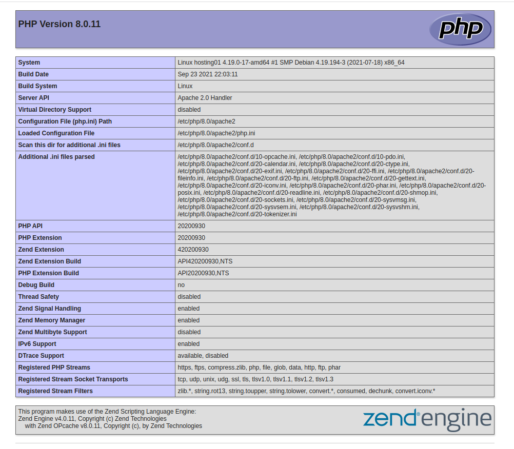
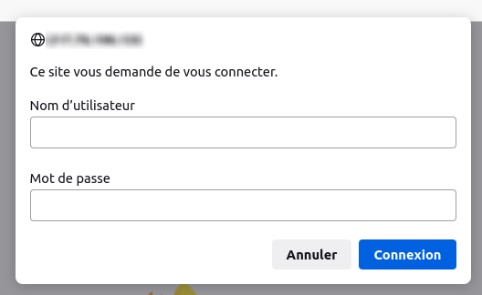

# 06b - Installation de PHP

Cette installation "standard" de PHP utilise le module Apache PHP.

```bash
sudo apt install php libapache2-mod-php
```

## Tester du site par défaut

```bash
sudo vi ${SERVER_DATAS_PATH}/var/www/html/000-default/htdocs/phpinfo.php
```

```php
<?php phpinfo();
```

Vérifier la configuration de PHP en visitant la page ```http://{{ YOUR_PUBLIC_IP }}/phpinfo.php``` depuis votre navigateur.



## Sécuriser l'accès à phpinfo

**phpinfo** est un indicateur visuel pratique pour avoir un aperçu de la configuration de votre serveur PHP.
Toutefois, il contient des informations sensibles qui donc faut protéger.

1. Mise en place de la protection htpassword

```bash
sudo vi ${SERVER_DATAS_PATH}/var/www/html/000-default/htdocs/.htaccess
```

```bash
<Files phpinfo.php>
AuthType Basic
AuthName "Authentication Required"
AuthUserFile ${SERVER_DATAS_PATH}/var/www/html/000-default/cnf/.htpasswd
Require valid-user
</Files>
```

2. Création d'un utilisateur habilité

```bash
sudo htpasswd -c ${SERVER_DATAS_PATH}/var/www/html/000-default/cnf/.htpasswd {{ YOUR_USER_LOGIN }}
```

*Renseigner un mot de passe, puis le confirmer lorsque l'invite de commande vous le demande.*

3. Ajout d'un utilisateur supplémentaire (Optionnel)

```bash
sudo htpasswd ${SERVER_DATAS_PATH}/var/www/html/000-default/cnf/.htpasswd {{ OTHER_USER_LOGIN }}
```

Vérifier la protection du fichier phpinfo.php en visitant la page ```http://{{ YOUR_PUBLIC_IP }}/phpinfo.php``` depuis votre navigateur.
Renseigner l'identifiant et le mot de passe.



## Configurer PHP

```bash
sudo vi /etc/php/{{ PHP_VERSION }}/apache2/php.ini
```

Exemple de configuration :

```diff
-upload_max_filesize = 2M
+upload_max_filesize = 200M
-post_max_size = 8M
+post_max_size = 200M
-;date.timezone =
+date.timezone = "Europe/Paris"
-;opcache.enable = 1
+opcache.enable = 1
-;sendmail_path =
+sendmail_path = "/usr/sbin/sendmail -t -i"
-memory_limit = 128M
+memory_limit = 1024M
```

## Configurer PHP Cli

```bash
sudo vi /etc/php/{{ PHP_VERSION }}/cli/php.ini
```

Exemple de configuration :

```diff
-;date.timezone =
+date.timezone = "Europe/Paris"
```

## Modules PHP

```bash
sudo apt install php-cgi php-cli php-curl php-gd php-imagick php-imap php-intl php-mbstring php-mysql php-soap php-xml php-zip
```

### Activer mbstring (Recommandé)

```bash
sudo phpenmod mbstring
```

## Installation étendue

### Installation de plusieurs versions de PHP

Il est possible de faire cohabiter plusieurs versions de PHP.

#### Installer PHP 5.6

```bash
sudo apt install php5.6 php5.6-cgi php5.6-cli php5.6-curl php5.6-gd php5.6-imagick php5.6-imap php5.6-intl php5.6-mbstring php5.6-mysql php5.6-soap php5.6-xml php5.6-zip
```

#### Installer PHP 7.0

```bash
sudo apt install php7.0 php7.0-cgi php7.0-cli php7.0-curl php7.0-gd php7.0-imagick php7.0-imap php7.0-intl php7.0-mbstring php7.0-mysql php7.0-soap php7.0-xml php7.0-zip
```

#### Installer HP 7.1

```bash
sudo apt install php7.1 php7.1-cgi php7.1-cli php7.1-curl php7.1-gd php7.1-imagick php7.1-imap php7.1-intl php7.1-mbstring php7.1-mysql php7.1-soap php7.1-xml php7.1-zip
```

#### Installer PHP 7.2

```bash
sudo apt install php7.2 php7.2-cgi php7.2-cli php7.2-curl php7.2-gd php7.2-imagick php7.2-imap php7.2-intl php7.2-mbstring php7.2-mysql php7.2-soap php7.2-xml php7.2-zip
```

#### Installer PHP 7.3

```bash
sudo apt install php7.3 php7.3-cgi php7.3-cli php7.3-curl php7.3-gd php7.3-imagick php7.3-imap php7.3-intl php7.3-mbstring php7.3-mysql php7.3-soap php7.3-xml php7.3-zip
```

#### Installer PHP 7.4

```bash
sudo apt install php7.4 php7.4-cgi php7.4-cli php7.4-curl php7.4-gd php7.4-imagick php7.4-imap php7.4-intl php7.4-mbstring php7.4-mysql php7.4-soap php7.4-xml php7.4-zip
```

#### Installer PHP 8.0

```bash
sudo apt install php8.0 php8.0-cgi php8.0-cli php8.0-curl php8.0-gd php8.0-imagick php8.0-imap php8.0-intl php8.0-mbstring php8.0-mysql php8.0-soap php8.0-xml php8.0-zip
```

#### Installer PHP 8.1

```bash
sudo apt install php8.1 php8.1-cgi php8.1-cli php8.1-curl php8.1-gd php8.1-imagick php8.1-imap php8.1-intl php8.1-mbstring php8.1-mysql php8.1-soap php8.1-xml php8.1-zip
```

#### Modifier la version courante de PHP

Désactivation de toutes les versions :

```bash
sudo a2dismod php5.6 && \
sudo a2dismod php7.0 && \
sudo a2dismod php7.1 && \
sudo a2dismod php7.2 && \
sudo a2dismod php7.3 && \
sudo a2dismod php7.4 && \
sudo a2dismod php8.0
```

Activation d'une version :

```bash
sudo a2enmod php8.0
```

#### Modifier la version courante de PHP Cli

```bash
sudo update-alternatives --config php
```
