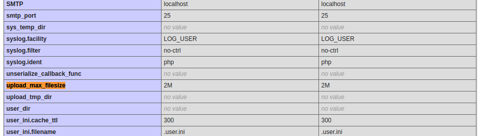

# 06c - Installation de PHP-FPM (5.6 >> 8.1)

## Installation basique

### Installation des versions de PHP 

```bash
sudo apt-get install php5.6-fpm php7.0-fpm php7.1-fpm php7.2-fpm php7.3-fpm php7.4-fpm php8.0-fpm php8.1-fpm
```

### Désactivation des versions standards de PHP

```bash
sudo a2dismod php5.6 php7.0 php7.1 php7.2 php7.3 php7.4 php8.0 php8.1 \
&& sudo a2dismod mpm_prefork
```

### Activation de PHP-FPM 

```bash
sudo a2enconf php5.6-fpm php7.0-fpm php7.1-fpm php7.2-fpm php7.3-fpm php7.4-fpm php8.0-fpm php8.1-fpm \
&& sudo a2enmod proxy_fcgi \
&& sudo a2enmod mpm_event
```

### Modification de l'hôte virtuel apache

```bash
sudo vi /etc/apache2/sites-enabled/000-default.conf  
``` 

```diff
<VirtualHost *:80> 
+    Include /etc/apache2/conf-available/php8.1-fpm.conf 
    Use vhost 000-default 
</VirtualHost>
``` 

> Adapter à la version de PHP souhaitée.

### Redémarrage du serveur

```bash
sudo systemctl restart php8.1-fpm \
&& sudo systemctl restart apache2
```

### Vérification

Vérifier la configuration de PHP en visitant la page http://{{ YOUR_PUBLIC_IP }}/phpinfo.php depuis votre navigateur.


## Personnalisation des pools



### Création d'un pool personnalisé

```bash
sudo mkdir -p ${SERVER_DATAS_PATH}/var/www/html/000-default/cnf/php8.1-fpm
```

```bash
sudo cp /etc/php/8.1/fpm/pool.d/www.conf ${SERVER_DATAS_PATH}/var/www/html/000-default/cnf/php8.1-fpm/www.conf
```

### Edition du pool personnalisé

```bash
sudo vi ${SERVER_DATAS_PATH}/var/www/html/000-default/cnf/php8.1-fpm/www.conf
``` 

A la fin du fichier, ajouter les instructions suivantes :

```diff
; Default Value: nothing is defined by default except the values in php.ini and
;                specified at startup with the -d argument
;php_admin_value[sendmail_path] = /usr/sbin/sendmail -t -i -f www@my.domain.com
;php_flag[display_errors] = off
;php_admin_value[error_log] = /var/log/fpm-php.www.log
;php_admin_flag[log_errors] = on
;php_admin_value[memory_limit] = 32M
+
+php_admin_value[upload_tmp_dir] = /srv/{{ (h|r)## }}-datas/var/www/html/000-default/tmp
+php_admin_value[session.save_path] = /srv/{{ (h|r)## }}-datas/var/www/html/000-default/tmp
+php_admin_value[sys_temp_dir] = /srv/{{ (h|r)## }}-datas/var/www/html/000-default/tmp
+php_admin_flag[log_errors] = on
+php_admin_value[upload_max_filesize] = 200M
+php_admin_value[post_max_size] = 200M
+php_admin_value[date.timezone] = "Europe/Paris"
+php_admin_value[opcache.enable] = 1
+php_admin_value[sendmail_path] = /usr/sbin/sendmail -t -i
+php_admin_value[memory_limit] = 1024M
```

### Déclaration des pools personnalisés

```bash
sudo vi /etc/php/8.1/fpm/php-fpm.conf
```

A la fin du fichier, ajouter l'instruction suivante :

```diff
include=/etc/php/8.1/fpm/pool.d/*.conf
+include=/srv/{{ (h|r)## }}-datas/var/www/html/*/cnf/php8.1-fpm/www.conf
```

> L'utilisation du joker (wildcard) permet de rendre cette déclaration dynamique et opérationnelle pour d'autre site. 

### Redémarrage de PHP-FPM

```bash
sudo systemctl restart php8.1-fpm
```

### Vérification

Vérifier la configuration de PHP en visitant la page http://{{ YOUR_PUBLIC_IP }}/phpinfo.php depuis votre navigateur.

