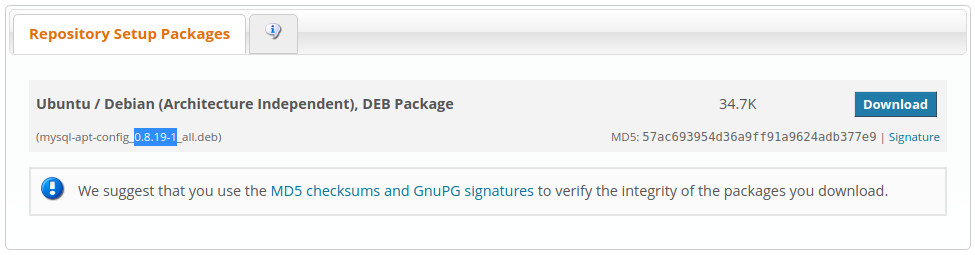
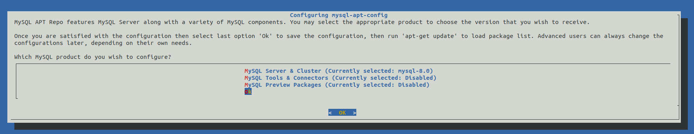
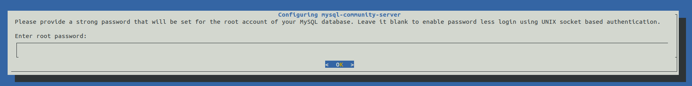
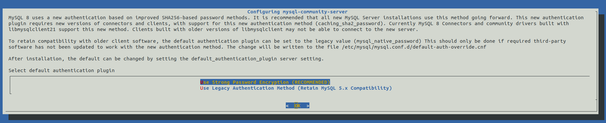

# 06d - Installation de MySQL

## Ajout du dépôt MySQL

```bash
sudo apt update && sudo apt install gnupg
```

Récupérer le numéro de version sur le [dépôt officiel](https://dev.mysql.com/downloads/repo/apt/).



Télécharger le dépôt :

```bash
cd /tmp && \
wget https://dev.mysql.com/get/mysql-apt-config_x.x.x-x_all.deb
```

Installer le dépôt :

```bash
sudo dpkg -i mysql-apt-config_x.x.x-x_all.deb
```



Laisser toutes les options par défaut et faire OK

*Ne pas tenir compte du message : Warning: apt-key should not be used in scripts (called from postinst maintainerscript of the package mysql-apt-config)*

Lancer l'installation de MySQL :

```bash
sudo apt update && sudo apt install mysql-server
```



Si vous laissez le mot de passe vide alors seuls l'utilisateur root et ceux habilités à la commande sudo pourront accéder au serveur (recommandé).



Vérifier l'installation :

```bash
sudo systemctl status mysql
```

Ou

```bash
sudo mysqladmin -u root -p version
```

Renseigner le mot de passe ou vide selon votre configuration. 

## Sécurisation de MySQL

```bash
sudo mysql_secure_installation
```

```
> Would you like to setup VALIDATE PASSWORD plugin ?
No
> Remove anonymous users ? 
Yes
> Disallow root login remotely ?
Yes
> Remove test database and access to it ?
Yes
> Reload privilege tables now ?
Yes
```

## Changer le mot de passe root

Laisser vide pour désactiver le mot de passe :

```bash
sudo mysqladmin -u root password {{ ROOT_PASSWORD_OR_EMPTY }}
```

## Création d'un utilisateur MySQL

```bash
sudo mysql -u root -p
```

### Habilité depuis la boucle locale

```bash
mysql> CREATE USER '{{ username }}'@'localhost' IDENTIFIED WITH mysql_native_password BY '{{ password }}';
mysql> GRANT ALL PRIVILEGES ON *.* TO '{{ username }}'@'localhost';
mysql> ALTER USER '{{ username }}'@'localhost' REQUIRE NONE WITH MAX_QUERIES_PER_HOUR 0 MAX_CONNECTIONS_PER_HOUR 0 MAX_UPDATES_PER_HOUR 0 MAX_USER_CONNECTIONS 0;
mysql> GRANT GRANT OPTION ON *.* TO '{{ username }}'@'localhost';
mysql> FLUSH PRIVILEGES;
mysql> exit
```

### Habilité depuis tous les serveurs d'origines

```bash
mysql> CREATE USER '{{ username }}'@'%' IDENTIFIED WITH mysql_native_password BY '{{ password }}';
mysql> GRANT ALL PRIVILEGES ON *.* TO '{{ username }}'@'%';
mysql> ALTER USER '{{ username }}'@'%' REQUIRE NONE WITH MAX_QUERIES_PER_HOUR 0 MAX_CONNECTIONS_PER_HOUR 0 MAX_UPDATES_PER_HOUR 0 MAX_USER_CONNECTIONS 0;
mysql> GRANT GRANT OPTION ON *.* TO '{{ username }}'@'%';
mysql> FLUSH PRIVILEGES;
mysql> exit
```

## Déplacer le répertoire de stockage des bases de données

Déplacer le répertoire de stockage des bases de données sur le disque de données permet d'éviter l'engorgement du disque système.

1. Modifier les droits du répertoire de stockage des données MySQL :

```bash
sudo chown mysql:mysql ${SERVER_DATAS_PATH}/var/lib/mysql/
```

2. Modifier le fichier de configuration :

```bash
sudo vi /etc/mysql/mysql.conf.d/mysqld.cnf
```

```diff
[mysqld]
pid-file        = /var/run/mysqld/mysqld.pid
socket          = /var/run/mysqld/mysqld.sock
-datadir         = /var/lib/mysql
+datadir = /srv/{{ (h|r)## }}-datas/var/lib/mysql
log-error       = /var/log/mysql/error.log
```

3. Arrêt du serveur :

```bash
sudo systemctl stop mysql
```

4. Copie des données du disque système vers le disque de données :

Passer en mode super-utilisateur

```bash
sudo -s
```

Copier le dossier

```
cp -p /var/lib/mysql/* -R /srv/{{ (h|r)## }}-datas/var/lib/mysql/ && \
exit
```

5. Redémarrer le serveur :

```bash
sudo systemctl start mysql
```

6. Tester le répertoire

```bash
cd ${SERVER_DATAS_PATH}/var/lib/mysql/
```

```bash
sudo mysql -h localhost -u root -p -e 'CREATE DATABASE `_delete` CHARACTER SET utf8 COLLATE utf8_general_ci;' && \
ls -l
```

> le dossier ```_delete``` doit exister !

```bash
sudo mysql -h localhost -u root -p-e 'DROP DATABASE `_delete`;'
```

## Commandes utiles

### Modifier les règles de mot de passe

**Lister :**

```bash
mysql> SHOW VARIABLES LIKE 'validate_password%';
```

**Modifier (exemple) :**

```bash
mysql> SET GLOBAL validate_password.special_char_count = 0;
```

**Révocation des droits :**

```bash
mysql> REVOKE ALL PRIVILEGES ON database_name.* FROM 'username'@'localhost';
```

**Supprimer un utilisateur :**

```bash
mysql> DROP USER 'username'@'localhost';
```

**Désactivation du plugin VALIDATE PASSWORD :**

```bash
mysql> UNINSTALL COMPONENT 'file://component_validate_password';
```
